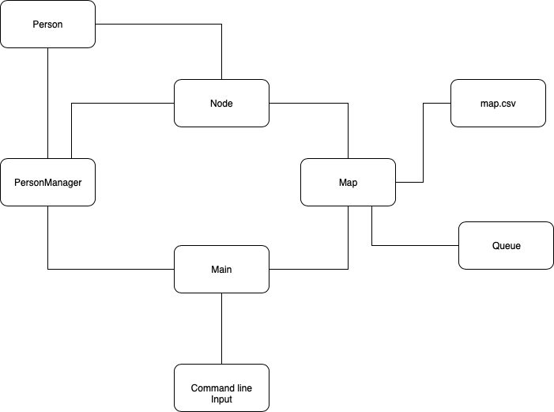

### Earthquake Simulator Architecture

This doc prentends to illustrate how the earthquake simulator is build.

### Team
------------
- [Fernando benavides](https://github.com/nockzblack)
- [Alexis Mendoza](https://github.com/AlexisFreud)

### Libreries
---------------
- [Pixel](https://github.com/faiface/pixel/)

### Diagram
---------------

As you can see there is a main file wich is the one that handles the user input from command line and validates it.

This file is in charge of create a map and a Person Manager.

The map loads the map from a .csv file and also needs its own queue to operate. The map turns the file map representation into a node one.

The person manager is the responsible for creating the number of people that the user indecated and also set them in a beginning pos (a node).

The person manager is the one that handles the simulation and each person inits his way to the exit.

